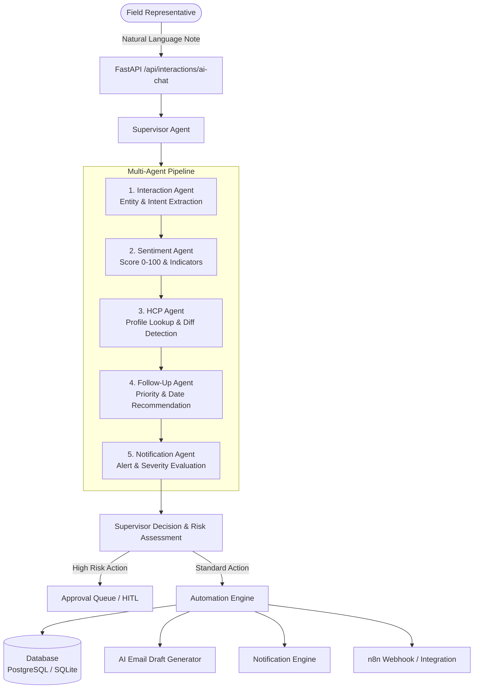

# AI-First HCP CRM & Autonomous Workflow Automation Platform

[](https://fastapi.tiangolo.com)
[](https://reactjs.org)
[](https://redux-toolkit.js.org/)
[](https://langchain.com)
[](https://groq.com)
[](https://www.postgresql.org/)
[](https://sqlite.org/)
[](https://www.docker.com/)
[](https://aws.amazon.com/)

An enterprise-grade, production-quality Healthcare Professional (HCP) CRM and Autonomous Workflow Automation Platform designed for pharmaceutical sales representatives and medical liaison teams. Built with a modern **React (Redux Toolkit)** frontend and a **Python FastAPI** backend powered by a multi-agent AI system (**LangGraph / LangChain / Groq LLM**) with event-driven automations, human-in-the-loop governance, and zero-config SQLite/PostgreSQL database support.

---

## Table of Contents

- [Key Features](#key-features)
- [Multi-Agent System Architecture](#multi-agent-system-architecture)
- [Tech Stack](#tech-stack)
- [Project Directory Structure](#project-directory-structure)
- [Getting Started Locally](#getting-started-locally)
  - [1. Backend Setup](#1-backend-setup)
  - [2. Frontend Setup](#2-frontend-setup)
  - [3. Pre-seeded Demo Credentials](#3-pre-seeded-demo-credentials)
- [Automated Testing & Verification](#automated-testing--verification)
- [Deployment Guide](#deployment-guide)
  - [AWS EC2 Free Tier (1-Click Deployment)](#aws-ec2-free-tier-1-click-deployment)
  - [Docker Compose (Production Multi-Container)](#docker-compose-production-multi-container)
  - [AWS Amplify (Frontend SPA)](#aws-amplify-frontend-spa)
  - [CI/CD via GitHub Actions](#cicd-via-github-actions)
- [API Endpoints Overview](#api-endpoints-overview)
- [License](#license)

---

## Key Features

### 1. Dual-Logging Interaction Engine
- **Structured Log Form**: Fast input with responsive doctor autocomplete, medical specialty/facility autofill, date-time selectors, interaction channel dropdowns (In-Person Meeting, Call, Email), and outcome recording.
- **Conversational AI Chat & Voice Logs**: Field reps can type or dictate freeform unstructured notes (e.g., *"Met Dr. Sharma today. Discussed CardioPlus clinical trials. Doctor was very impressed, requested trial data. Follow up next Tuesday."*).
- **Live Entity Preview & Confirmation**: AI extracts structured fields (Doctor Name, Specialty, Hospital, Product, Sentiment, Engagement Score, Next Action) for rep review and one-click confirmation into CRM.

### 2. Multi-Agent AI Orchestration
- Autonomous cooperative agents work sequentially and report to a central **Supervisor Agent**:
  - `InteractionAgent`: Extracts clinical entities, products, intents, and action items.
  - `SentimentAgent`: Analyzes tone and assigns engagement score (0–100) with key signals and concerns.
  - `HCPAgent`: Resolves doctor records against the database, flags profile discrepancies, and recommends profile updates.
  - `FollowUpAgent`: Predicts required follow-ups, parses relative dates, and determines task priority.
  - `NotificationAgent`: Evaluates severity and fires real-time alerts for critical events.
  - `SupervisorAgent`: Synthesizes outputs, determines risk levels, and routes high-risk tasks to human review.

### 3. Event-Driven Automation Engine
- Pub/Sub automation event pipeline (`interaction.created`, `followup.overdue`, `sentiment.negative`, etc.).
- Automatically creates contextual follow-up tasks, updates doctor insights, creates notification alerts, and triggers webhook integrations (e.g., n8n).

### 4. Human-in-the-Loop (HITL) Governance & Approvals
- High-risk AI actions (e.g., sending follow-up emails, critical profile updates) are flagged with risk levels (`Low`, `Medium`, `High`, `Critical`).
- Dedicated **Approvals Portal** where managers and reps can review AI rationale, examine diffs, and approve or reject actions.

### 5. Automated Email Follow-Up Generation
- Generates context-aware, medically tailored follow-up email drafts automatically based on interaction discussion points and HCP preferences.

### 6. AI Action Center
- Real-time hub providing visibility into all automated tasks: pending approvals, AI-generated email drafts, system alerts, and audit logs.

### 7. HCP Directory & 360° Profile Timeline
- Doctor directory searchable by name, specialty, hospital/clinic, and therapeutic preference.
- Chronological, vertical touchpoint timeline showing every past meeting, call, email, and sentiment evolution.
- Real-time AI Insight summary widget with engagement score gauge and therapeutic alignment.

### 8. Follow-up Task Manager
- Due-date sorted priority queue with inline check-to-complete boxes syncing instantly to the database.

### 9. Analytics & Visual Intelligence
- Real-time KPI summaries, sentiment split pie charts, doctor engagement distributions, and pharmaceutical product share-of-voice charts.

### 10. Zero-Config Double-Fallback Architecture
- If `GROQ_API_KEY` is not provided or network is unavailable, the backend automatically falls back to an internal **NLP heuristic parser**, allowing 100% functionality offline without external dependencies.
- Database automatically falls back to SQLite (`crm_fallback.db`) if PostgreSQL is not configured.

---

## Multi-Agent System Architecture



---

## Tech Stack

| Layer | Technologies |
|---|---|
| **Frontend** | React 18, Vite, Redux Toolkit (State Management), React Router v6, Lucide React, Recharts |
| **Styling** | Vanilla CSS (Tailored Design System, Custom Theme Tokens, Glassmorphism, Responsive Grid) |
| **Backend API** | Python 3.10+, FastAPI, Pydantic v2, SQLAlchemy 2.0 ORM, Uvicorn |
| **Security** | OAuth2 Bearer Tokens, PyJWT, direct `bcrypt` password hashing |
| **AI & NLP** | LangChain, LangGraph Multi-Agent Workflows, Groq LLM (`gemma2-9b-it`, `llama-3.3-70b-versatile`), Built-in Local Heuristic NLP Parser |
| **Database** | PostgreSQL 16 (Production) / SQLite (`crm_fallback.db` for zero-dependency local dev) |
| **Caching & Queues**| Redis (Cache & Event queues) |
| **Automation** | Event-Driven Engine, n8n Workflow Automation Webhooks |
| **DevOps & Cloud** | Docker, Docker Compose, AWS EC2 (Free Tier t2.micro/t3.micro), Nginx, Systemd, AWS Amplify, GitHub Actions |

---

## Project Directory Structure

```
AI-HCP/
├── .github/
│   └── workflows/
│       └── deploy.yml            # CI/CD pipeline for automated testing & EC2 deployment
├── crm_backend/                  # FastAPI Backend Application
│   ├── app/
│   │   ├── agent/                # Multi-agent AI engine & tools
│   │   │   ├── agent.py          # Workflow runner & fallback extractors
│   │   │   ├── agents.py         # Multi-agent implementations (Interaction, Sentiment, HCP, etc.)
│   │   │   ├── state.py          # LangGraph agent state schemas
│   │   │   └── tools.py          # CRM database agent tools
│   │   ├── api/                  # API routers
│   │   │   ├── auth.py           # Authentication & token endpoints
│   │   │   ├── hcps.py           # HCP directory & profiles endpoints
│   │   │   ├── interactions.py   # Interaction logging & AI chat endpoints
│   │   │   ├── followups.py      # Follow-up task management endpoints
│   │   │   ├── analytics.py      # Analytics & KPI metrics endpoints
│   │   │   └── automation.py     # Automation events, actions, approvals, drafts, alerts
│   │   ├── core/                 # Core configs, DB sessions, security utilities
│   │   ├── models/               # SQLAlchemy ORM database models
│   │   ├── repositories/         # Repository Pattern database queries
│   │   ├── schemas/              # Pydantic validation models
│   │   ├── services/             # Business logic & automation engine
│   │   └── main.py               # FastAPI entry point & CORS configuration
│   ├── requirements.txt          # Python dependencies
│   ├── seed.py                   # Database seeding script (mock doctors, users, interactions)
│   ├── run.py                    # Local server runner script
│   └── Dockerfile                # Backend container configuration
├── frontend/                     # React Single Page Application (SPA)
│   ├── src/
│   │   ├── components/           # Reusable components (Sidebar, ProtectedRoute, Toast, Skeleton)
│   │   ├── features/             # Redux slices (auth, hcp, interaction, followup, analytics, automation)
│   │   ├── pages/                # Application views
│   │   │   ├── Dashboard.jsx     # Main KPI dashboard & quick actions
│   │   │   ├── LogInteraction.jsx# Dual-mode logging interface (Form + Conversational AI)
│   │   │   ├── AIActionCenter.jsx# Live automation feed, drafts, and system alerts
│   │   │   ├── Approvals.jsx     # Human-in-the-loop task approval portal
│   │   │   ├── HCPList.jsx       # Doctor directory with search & filters
│   │   │   ├── HCPProfile.jsx    # Doctor 360° profile, touchpoint timeline & AI insights
│   │   │   ├── FollowUps.jsx     # Follow-up tasks priority manager
│   │   │   ├── Notifications.jsx # Real-time alerts notification center
│   │   │   ├── Analytics.jsx     # Sentiment & discussion share analytics
│   │   │   └── Login.jsx         # Sign in portal with instant demo autofill
│   │   ├── services/             # Axios API client & token interceptors
│   │   ├── store.js              # Redux store configuration
│   │   ├── App.jsx               # Route mapping & layout wrapper
│   │   ├── index.css             # Tailored design system & CSS variables
│   │   └── main.jsx              # React app mount
│   ├── package.json              # Frontend npm packages
│   └── Dockerfile                # Frontend Nginx container configuration
├── deploy/                       # Cloud & VM Deployment Scripts
│   ├── setup.sh                  # One-click Ubuntu / EC2 setup script
│   ├── nginx.conf                # Nginx reverse proxy configuration
│   └── ai-hcp.service            # Systemd service unit with memory limit controls
├── docker-compose.yml            # Multi-service production stack (PostgreSQL, Redis, Backend, Frontend, n8n)
├── amplify.yml                   # AWS Amplify build configuration
├── automation_test.py            # Event engine smoke test
└── full_e2e_test.py              # Full end-to-end integration test suite
```

---

## Getting Started Locally

### Prerequisites
- Python 3.10 or higher
- Node.js 18 or higher (with npm)
- *(Optional)* Git and Groq API Key (for LLM acceleration)

---

### 1. Backend Setup

1. Open your terminal and navigate to the backend directory:
   ```bash
   cd crm_backend
   ```

2. Create and activate a Python virtual environment:
   ```bash
   # On macOS / Linux
   python3 -m venv venv
   source venv/bin/activate

   # On Windows (PowerShell)
   python -m venv venv
   .\venv\Scripts\Activate.ps1
   ```

3. Install backend dependencies:
   ```bash
   pip install -r requirements.txt
   ```

4. Configure your environment variables:
   - Create a `.env` file in `crm_backend/` (or copy `.env.example`):
     ```bash
     cp .env.example .env
     ```
   - Standard default configuration (Zero-config SQLite):
     ```env
     DATABASE_URL=sqlite:///./crm_fallback.db
     JWT_SECRET=your-secure-random-jwt-secret
     JWT_ALGORITHM=HS256
     ACCESS_TOKEN_EXPIRE_MINUTES=1440
     DEFAULT_MODEL=gemma2-9b-it
     # Optional: Add your Groq API Key for cloud LLM reasoning
     GROQ_API_KEY=gsk_your_groq_api_key_here
     ```

5. Seed the database with sample doctors, interactions, and demo users:
   ```bash
   python seed.py
   ```

6. Start the FastAPI development server:
   ```bash
   python run.py
   ```
   - Backend API: `http://localhost:8000`
   - Interactive Swagger API Documentation: `http://localhost:8000/docs`

---

### 2. Frontend Setup

1. Open a new terminal tab and navigate to the frontend directory:
   ```bash
   cd frontend
   ```

2. Install npm packages:
   ```bash
   npm install
   ```

3. Start the Vite development server:
   ```bash
   npm run dev
   ```
   - The application will be accessible at: `http://localhost:5173/`

---

### 3. Pre-seeded Demo Credentials

You can sign in immediately using either of these default accounts:

| Username | Password | Role | Description |
|---|---|---|---|
| `rep1` | `password123` | Medical Representative | Field sales representative account |
| `admin` | `password123` | Administrator / Manager | Full administrative & approval access |

> **Pro Tip**: On the login page, simply click the **"Autofill Demo Representative"** button to log in with 1 click.

---

## Automated Testing & Verification

The repository includes end-to-end integration tests that verify database operations, multi-agent execution, event publication, and action automation:

```bash
# Run the full end-to-end integration test
python full_e2e_test.py

# Run the event engine pipeline test
python automation_test.py
```

---

## Deployment Guide

### AWS EC2 Free Tier (1-Click Deployment)

The project is optimized to run effortlessly on an AWS Free Tier instance (`t2.micro` or `t3.micro` with 1 vCPU and 1 GB RAM):

1. Launch an Ubuntu 22.04 or 24.04 EC2 instance.
2. Clone the repository and execute the setup script:
   ```bash
   git clone https://github.com/<your-username>/AI-HCP.git ai-hcp
   cd ai-hcp
   sudo bash deploy/setup.sh
   ```
3. The script automatically:
   - Installs Python, Node.js, and Nginx.
   - Configures `ai-hcp.service` systemd daemon with memory guards.
   - Builds the production React bundle into `/var/www/ai-hcp`.
   - Sets up Nginx reverse proxy forwarding `/api` requests to port 8000 and serving the SPA.

#### Resource Optimization for 1GB Free Tier:

| Service | Mode | Memory Usage |
|---|---|---|
| FastAPI Backend | Single Worker (Uvicorn) | ~180 MB |
| Database | SQLite (`crm_fallback.db`) | ~10 MB |
| Nginx Web Server | Static Asset Proxy | ~25 MB |
| System OS & Buffer | Linux Kernel | ~300 MB |
| **Total Memory** | | **~515 MB / 1000 MB** *(Plenty of headroom)* |

---

### Docker Compose (Production Multi-Container)

For production deployments with dedicated PostgreSQL and Redis:

```bash
# Start Core Services (PostgreSQL + Redis + Backend + Frontend)
docker-compose up -d --build

# Start with n8n Workflow Automation engine enabled
docker-compose --profile automation up -d --build
```

---

### AWS Amplify (Frontend SPA)

The repository includes `amplify.yml` for zero-configuration deployment to AWS Amplify:
1. Connect your repository to AWS Amplify Console.
2. Amplify automatically detects `amplify.yml`.
3. Set your backend URL environment variable (`VITE_API_URL`) in the Amplify Console.
4. Deploy!

---

### CI/CD via GitHub Actions

A continuous integration and continuous deployment pipeline is located at `.github/workflows/deploy.yml`:
- **On Pull Request & Push**: Executes backend smoke tests, lints, and builds the frontend bundle.
- **On Push to `main`**: Automatically connects via SSH to your EC2 instance and deploys changes seamlessly.

To activate automated deployment, set the following GitHub Secrets:
- `EC2_HOST`: Server public IP address.
- `EC2_USER`: `ubuntu`
- `EC2_KEY`: Private `.pem` key content.

---

## API Endpoints Overview

| Tag | Method | Endpoint | Description |
|---|---|---|---|
| **Auth** | `POST` | `/api/auth/login` | Authenticate user & receive Bearer JWT token |
| **Auth** | `GET` | `/api/auth/me` | Retrieve profile of currently authenticated user |
| **HCPs** | `GET` | `/api/hcps` | List all doctors with optional search filters |
| **HCPs** | `POST` | `/api/hcps` | Create a new doctor profile |
| **HCPs** | `GET` | `/api/hcps/{id}` | Get doctor 360° profile, interactions, and AI insights |
| **Interactions** | `GET` | `/api/interactions` | Retrieve interaction logs |
| **Interactions** | `POST` | `/api/interactions` | Log structured interaction entry |
| **Interactions** | `POST` | `/api/interactions/ai-chat` | Multi-agent natural language parser & entity extractor |
| **Follow-ups** | `GET` | `/api/followups` | Retrieve pending & completed follow-up tasks |
| **Follow-ups** | `PATCH` | `/api/followups/{id}` | Update follow-up status (Pending / Completed) |
| **Analytics** | `GET` | `/api/analytics/dashboard` | Aggregated KPIs, sentiment split, and product metrics |
| **Automation** | `GET` | `/api/automation/action-center` | Aggregated AI Action Center feed |
| **Automation** | `GET` | `/api/automation/approvals` | List approval requests with risk ratings |
| **Automation** | `POST` | `/api/automation/approvals/{id}/decide` | Approve or reject AI proposed actions |
| **Automation** | `GET` | `/api/automation/notifications` | Fetch user alerts by severity |
| **Automation** | `GET` | `/api/automation/email-drafts` | Retrieve AI generated follow-up email drafts |

---

## License

This project is open source and available under the [MIT License](LICENSE).
